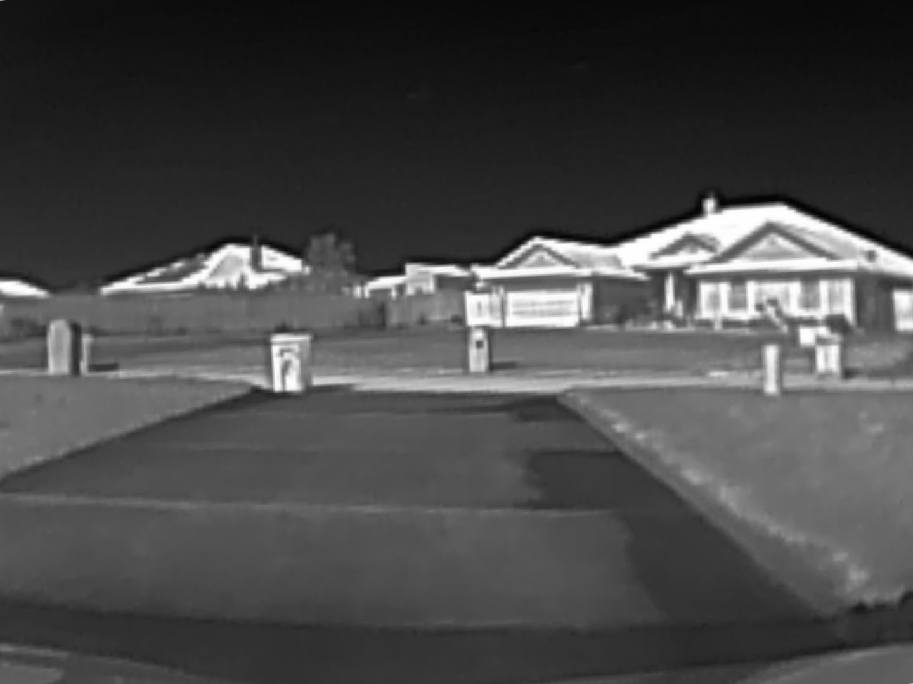

# TeslaThermalCam

> **Disclaimer**: This README and the associated code are currently in a rough draft stage. Both will undergo significant changes as the project progresses. The project has been uploaded to GitHub at this early stage to facilitate the use of source code control and a CI/CD pipeline.

Welcome to TeslaThermalCam, a unique project that brings thermal imaging right into your Tesla's in-car browser. This project utilizes a P2 Pro thermal camera and a Raspberry Pi 5 to capture and stream thermal video, providing a new perspective on your surroundings.

## Project Overview

TeslaThermalCam is designed to run on a Raspberry Pi 5, which is installed in the frunk of your Tesla. The system uses a custom Python application to read video feeds from the P2 Pro thermal camera and delivers the video to your Tesla's browser using a Motion JPEG stream. 

## Key Features

- **Thermal Video Capture**: The P2 Pro thermal camera captures high-quality thermal video, which is read by our custom Python application.
- **In-Car Display**: The thermal video is streamed directly to your Tesla's browser.
- **Raspberry Pi Integration**: The entire system runs on a Raspberry Pi 5, which can be conveniently installed in your Tesla's frunk.
- **WiFi Connectivity**: The Raspberry Pi connects to the internet via a WiFi hotspot, ensuring consistent video streaming.

## Getting Started

To get started with TeslaThermalCam, you'll need to set up your Raspberry Pi with the necessary software and libraries, install and configure the Python application, and establish network connectivity. Detailed configuration steps can be found in the [Configuration Steps](#configuration-steps) section.

## Hardware Components

The TeslaThermalCam project requires the following hardware components:

- **Raspberry Pi 5**: This serves as the main computing unit for the project. It reads the video feed from the thermal camera, processes it, and streams it to the Tesla's browser.

- **P2 Pro Thermal Camera**: This camera captures thermal video, providing a unique perspective on the surroundings. It connects to the Raspberry Pi via a USB-C cable.

- **Connectivity Cables**: A USB-A male to USB-C female cable is required to connect the Raspberry Pi to the thermal camera.

- **3D Printed Hood Mount**: This mount is used to securely position the thermal camera on the car. It can be custom-made to fit the specific model of your Tesla.

- **Power Supply**: The Raspberry Pi needs a power source. This can be provided by the Tesla's 12V battery, which is automatically charged as it depletes. Please note that the final power installation in the car should be completed after thorough testing to ensure everything works as expected.

- **WiFi Hotspot**: The Raspberry Pi connects to the internet via a WiFi hotspot. This can be provided by a travel router connected to an iPhone's personal hotspot, eliminating the need for a separate 4G dongle.

- **Flask Web Server**: This is a lightweight web server that runs on the Raspberry Pi. It serves the Motion JPEG video stream to the Tesla's browser.
## Configuration Steps

See [docs/hardware_setup.md](docs/hardware_setup.md) for instructions on mounting the camera, connecting cables, supplying power, and setting up networking.

## Roadmap

Our project development is divided into several stages. Here's a brief overview of our roadmap:

- [x] **Proof of Concept (In Progress)**: We're currently in the proof of concept stage, where we're testing the feasibility of the project and working out the basic functionality.

- [x] **Setup GitHub Repo**: The GitHub repository for the project has been set up.

- [x] **Add Photos to the Repo**: We've added photos to the repo to provide a visual representation of the project.

- [x] **Create a Docker Container for the Application**: We've packaged the application into a Docker container to make it easy to deploy and run.

- [x] **Document How to Setup Watchtower**: We've provided documentation on how to set up Watchtower for automatic updates.

- [x] **Host Docker Container on DockerHub or Alternative**: We've hosted the Docker container on DockerHub for easy access.

- [x] **Setup CI/CD Pipeline for building docker images and limited tests**: We've set up a CI/CD pipeline for building Docker images and running limited tests. More tests will be added in the future.

- [ ] **Detail the Hardware Installation**: We'll provide detailed instructions for the hardware installation process.

- [ ] **Include Tailscale for Remote Control Ability**: We'll integrate Tailscale into the project to provide remote control capabilities.

- [ ] **Add AI Object Detection**: We'll add AI object detection to the project to provide additional functionality.

Please note that this roadmap is subject to change as the project progresses.

## Join Us

We welcome contributions and suggestions! Feel free to open an issue or submit a pull request.

## License

This project is licensed under the MIT License - see the [LICENSE.md](LICENSE.md) file for details.
